## Hướng dẫn cấu hình xác thực OTP sử dụng Google Authenticator cho PFSense

### Mục tiêu

Bài lab hướng dẫn việc sử dụng phương thức xác thực 1 lần OTP Google Authenticator để xác thực user khi quay VPN tới PFSense

## Mô hình 
- Sử dụng mô hình dưới để cài đặt

## IP Planning
- Phân hoạch IP cho các máy chủ trong mô hình trên

## Chuẩn bị và môi trường LAB
Hệ thống VMWare Workstation với các card mạng sau
- VMNet8: NAT ra Internet.
- VMnet3: LAN2 (giả lập mạng private trong PFSense)
- VMnet1: Host-only (quản lý PFSense)

 

## Tạo máy ảo PFSense trên VMWare
- Cấu hình máy ảo và card mạng như sau:

Lưu ý: OS chọn Other/FreeBSD (32 hoặc 64 tùy phiên bản)

## Cài đặt PFSense
- Thực hiện theo hướng dẫn [sau](pfSense-install.md)

## Cấu hình VPN mode TAP theo hướng dẫn [sau](pfSense-OpenVPN-TAPmode.md)

## Cấu hình sử dụng GoogleAuth

- Vào System > PackageManager > Available Packager, tìm và cài đặt gói freeradius3
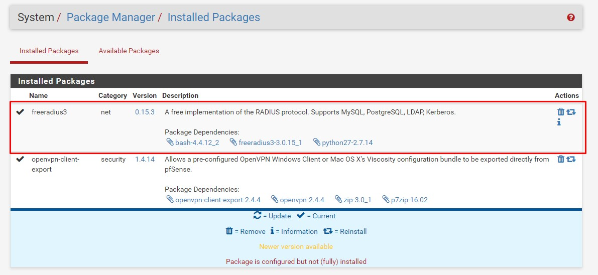

- Vào Services > FreeRADIUS > Interfaces, Add thêm interface cho freeradius
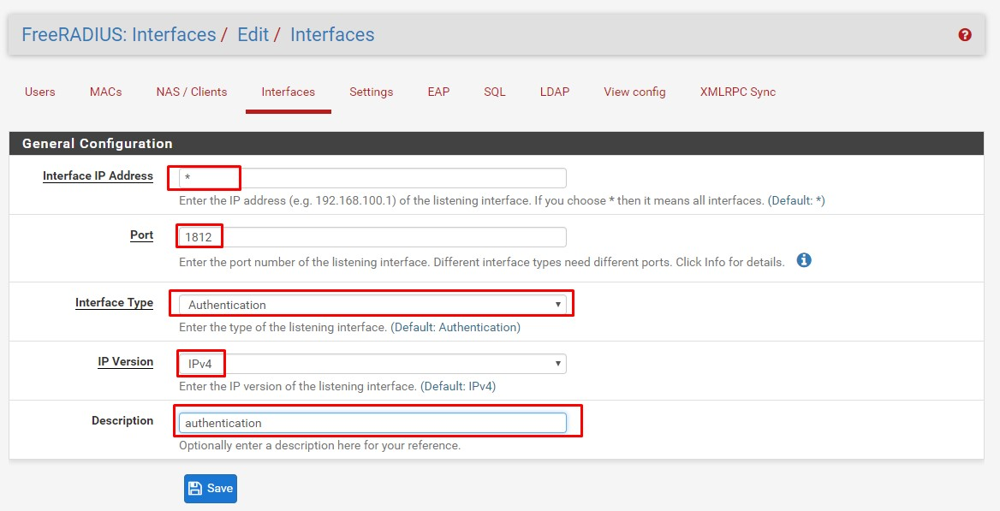

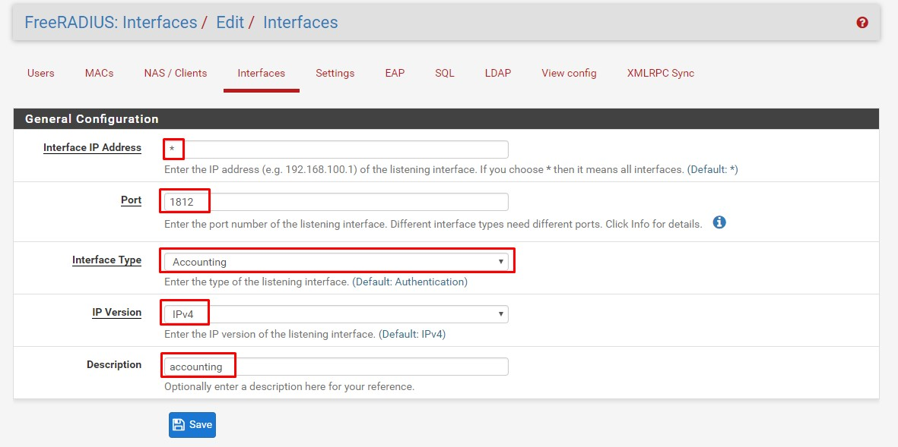

- Vào Services > FreeRADIUS > NAS/Clients, tạo NAS client
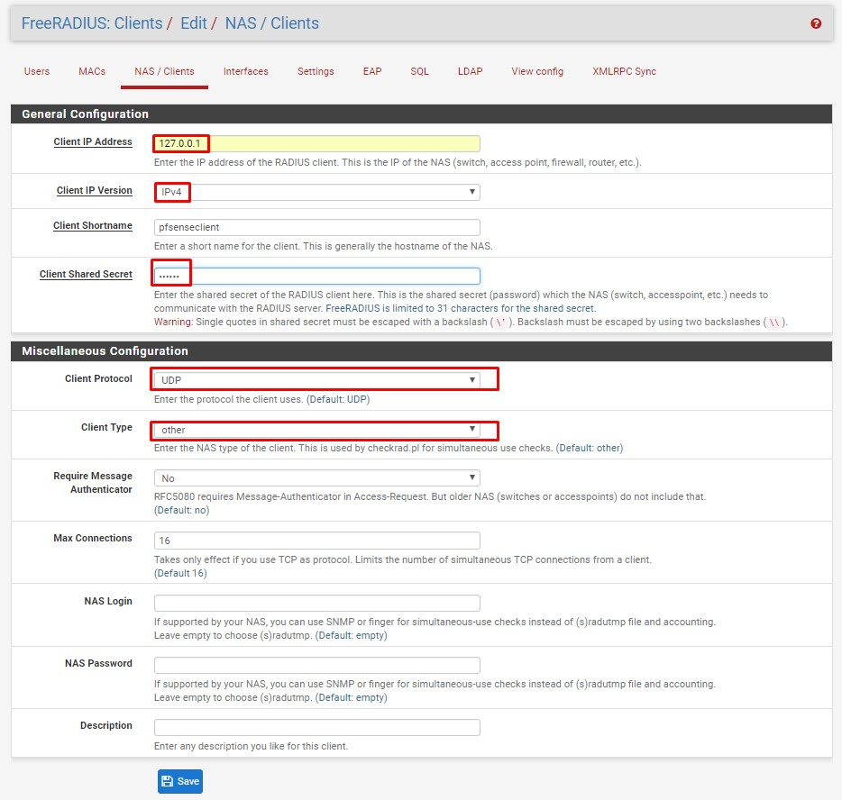

- Vào Services > FreeRADIUS > Users, tạo user được chứng thực bởi Radius
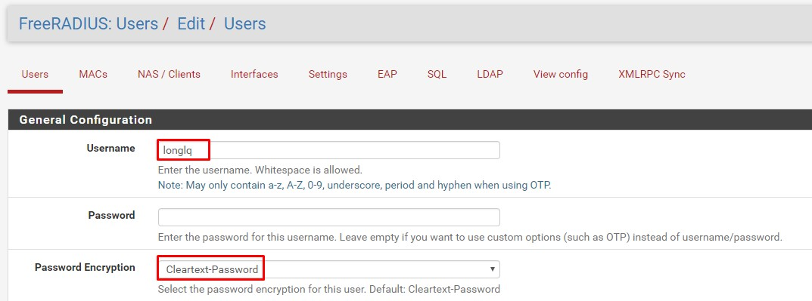

- Lựa chọn sử dụng One-time password, sau đó dùng ứng dụng Google authenticator để quét QR Code hoặc nhấn vào "Generate OTP Secret" để lấy init secret
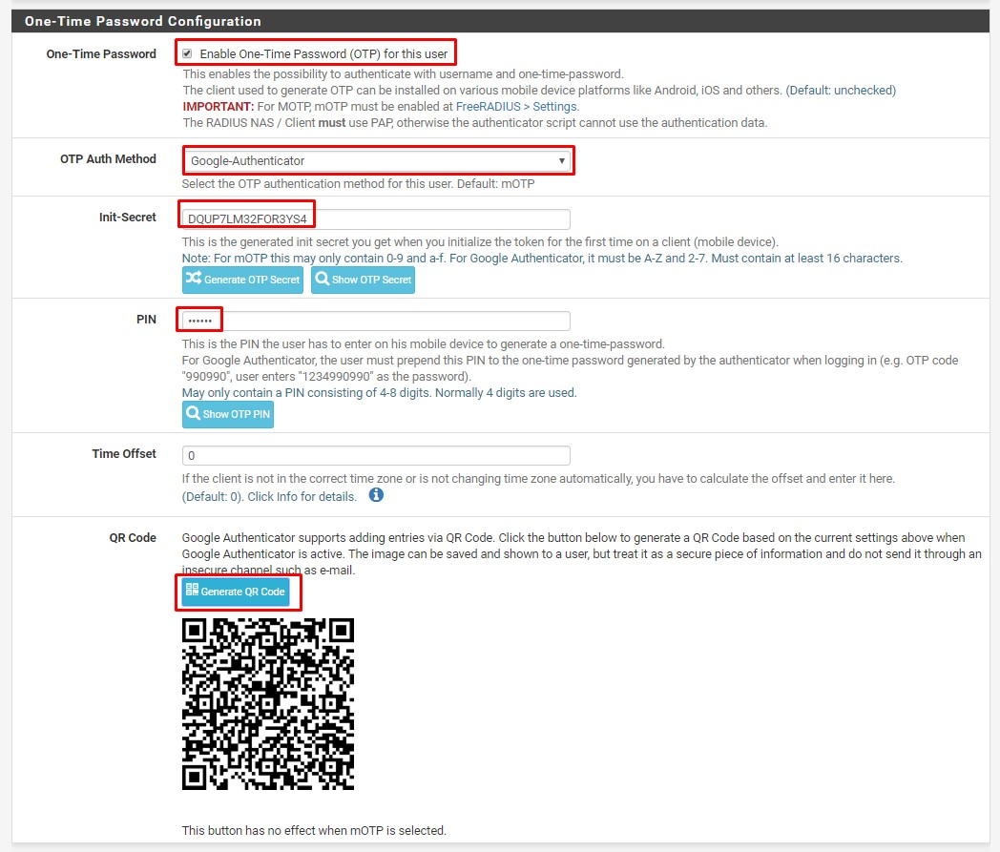

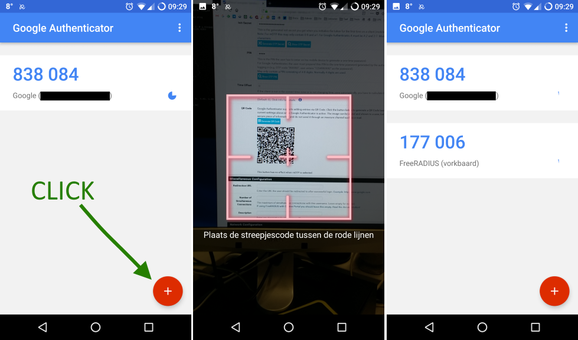

- Vào System > User Manager > Authentication Servers, tạo server chứng thực. Lưu ý: sử dụng Shared secret đã khai báo ở bước tạo NAS Client
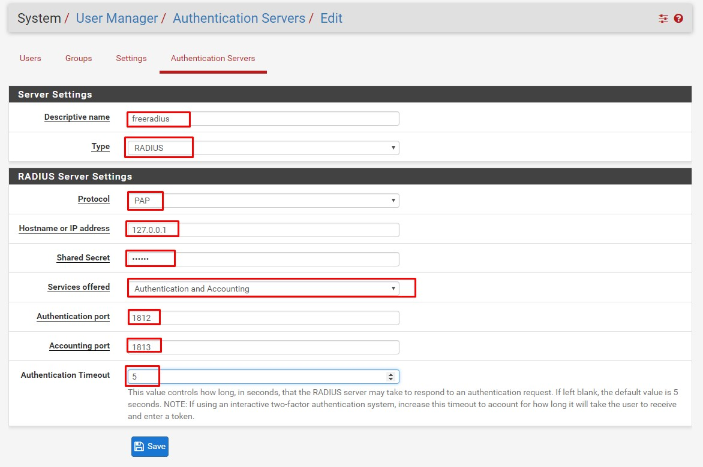

- Vào VPN > OpenVPN > Servers, sửa lại Authentication Backend của VPN Server là Freeradius server vừa tạo ở trên
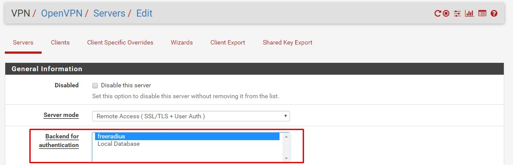

- Mặc định, OpenVPN Client sẽ thực hiện bắt tay lại với server sau 3600s, do Google OTP chỉ có hiệu lực trong 30s, do đó, việc này sẽ khiến Client bị mất kết nối và phải log in lại sau 3600s. Để disable việc bắt tay lại này, thực hiện như sau.
Tại VPN > OpenVPN > Servers, Thêm `reneg-sec 0`  vào "Custom Options"
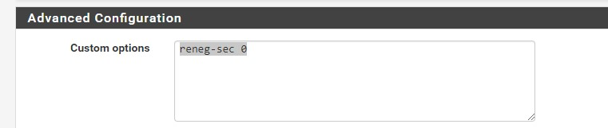

- Tại VPN > OpenVPN > Client Export Utility, Thêm `reneg-sec 0`  vào "Additional configuration options"
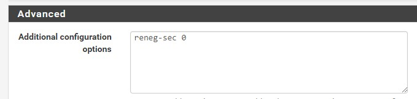

- Để kiểm tra việc xác thực bằng freeradius, vào Diagnostics > Authentication, nhập user vừa tạo và password. Lưu ý, password = PIN + Google Authenticator code.
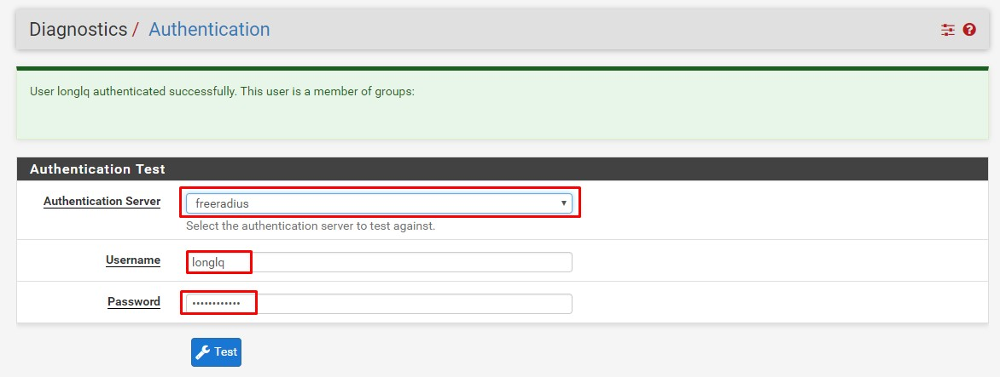

- Vào VPN > OpenVPN > Client Export Utility, download gói cài đặt openvpn cho client và cài đặt.

- Khi nhận được yêu cầu xác thực, nhập tên user và password.
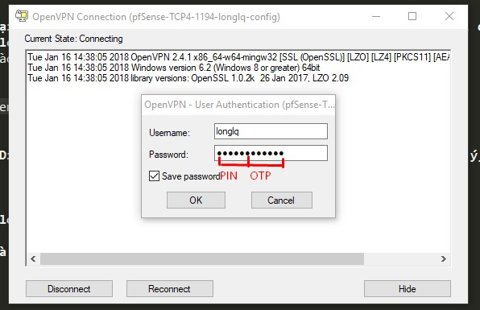

Tham khảo:

[1] - https://vorkbaard.nl/how-to-set-up-openvpn-with-google-authenticator-on-pfsense/

