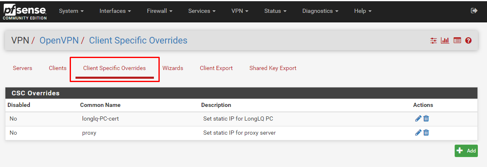
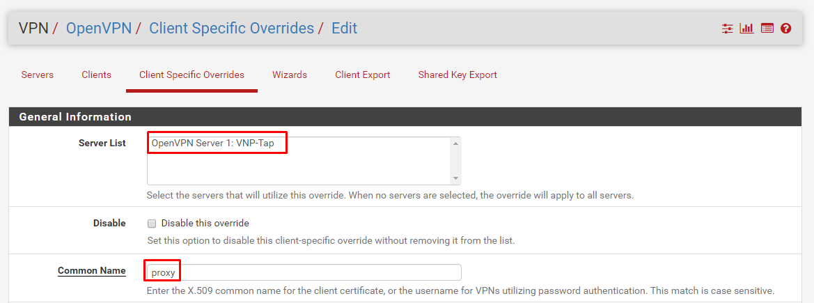
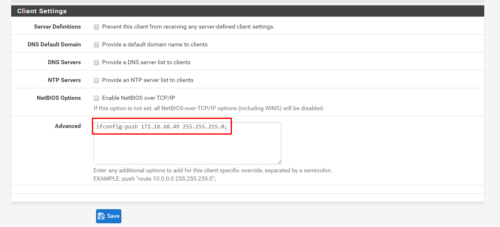

## Hướng dẫn đặt IP cố định cho VPN Client

## Chuẩn bị và môi trường LAB
- Máy Client: có thể sử dụng hệ điều hành Linux hoặc Windows (tùy vào loại hệ điều hành mà cài gói OpenVPN client tương ứng), trong bài lab này sẽ sử dụng OS Windows 10.
- Máy PFSense: tham khảo hướng dẫn cài đặt ở [đây](./pfSense-install.md)
 
## Thực hiện trên PFSense

### Trên giao diện quản lý, vào mục `ClientSpecific Overrides` và chọn `Add`

### Lựa chọn Server OpenVPN và CA Cert được fix IP

Lưu ý: trường `Common Name` phải khai báo CA Cert của Client được fix IP.

### Khai báo IP được gán cho Client và `Save`

## Thực hiện trên Client

Trên Client, kết nối VPN và nhận IP được gán.

# Tham khảo:
- https://wpcomputersolutions.com/pfsense-set-static-ip-specific-openvpn-client/
